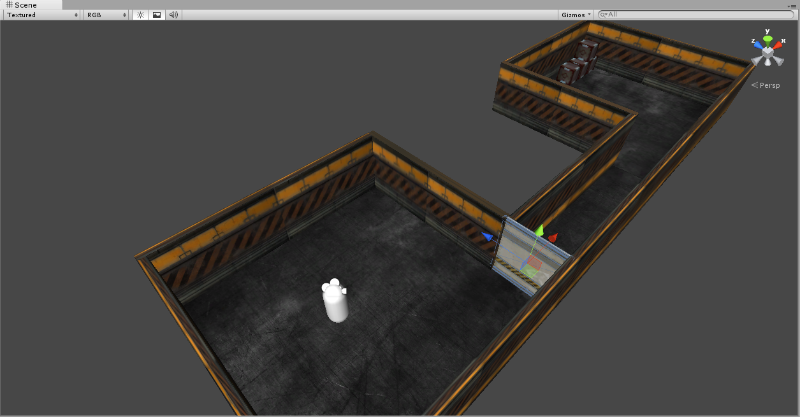
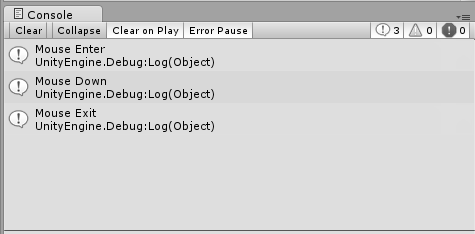
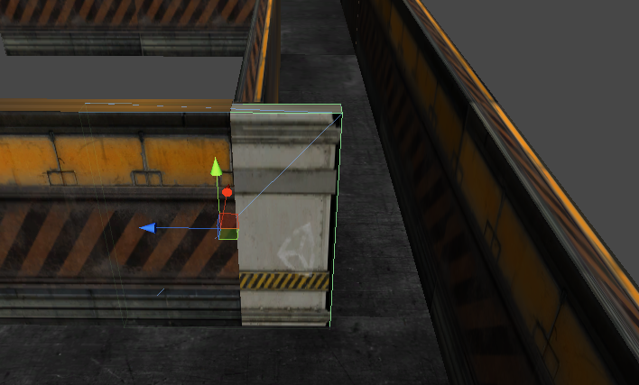
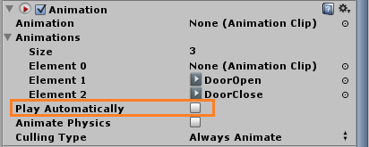
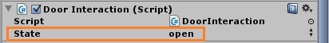
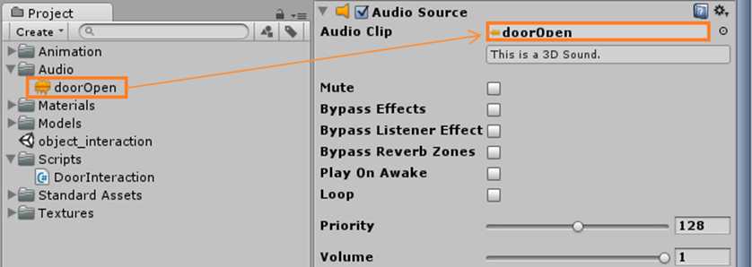
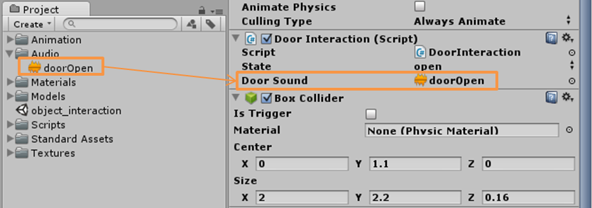
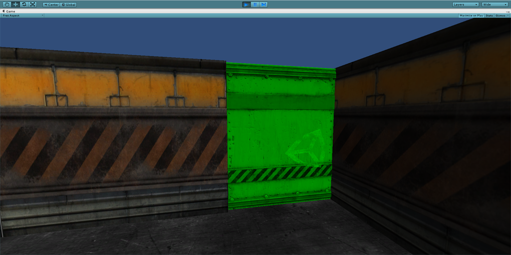

In a video game interacting with surroundings what makes the game enjoyable and realistic. In this post, I will show how to simply interact with objects in Unity3D. Let's get started!

Initially, I have a scene including two rooms that are connected to each other with a short hallway. There is a door in the room where my First Person Controller stands in.

Our purpose is to enable player to open and close the door with mouse input.

Add a C# script to your project ( Assets > Create > C# Script ), rename script file as **"DoorInteraction"**. Open your script file, so we can start coding.

>**Check your class name! The class name and script file name must be the same to enable the script component to be attached to a GameObject.**

By default you have your **<a href="http://docs.unity3d.com/Documentation/ScriptReference/MonoBehaviour.Start.html">Start()</a>** and **<a href="http://docs.unity3d.com/Documentation/ScriptReference/MonoBehaviour.Update.html">Update()</a>** functions. Let's add some event functions such as **<a href="http://docs.unity3d.com/Documentation/ScriptReference/MonoBehaviour.OnMouseDown.html">OnMouseEnter()</a>**, **<a href="http://docs.unity3d.com/Documentation/ScriptReference/MonoBehaviour.OnMouseExit.html">OnMouseExit()</a>** and **<a href="http://docs.unity3d.com/Documentation/ScriptReference/MonoBehaviour.OnMouseDown.html">OnMouseDown()</a>**. These functions help us to interact with our door object.


using UnityEngine;
using System.Collections;

public class DoorInteraction : MonoBehaviour {

    // Use this for initialization
    void Start () {
	
    }
	
    // Update is called once per frame
    void Update () {
	
    }

    //When the mouse enters the object
    public void OnMouseEnter() {
        Debug.Log("Mouse Enter");
    }

    //When the mouse exits th object
    public void OnMouseExit() {
        Debug.Log("Mouse Exit");
    }

    //When user clickes the left mouse button 
    public void OnMouseDown() {
        Debug.Log("Mouse Down");
    }
}


Instead of **OnMouseDown()**, you can also use **<a href="http://docs.unity3d.com/Documentation/ScriptReference/MonoBehaviour.OnMouseUp.html">OnMouseUp()</a>**. Difference is, **OnMouseUp()** function is called when the mouse button is released and even if the mouse is not over the same object.

You can throw some debug statements to test your mouse events. If you see the proper output on the console you can continue, **but if your mouse events don't work check whether your object has a Collider.** 

>**Mouse events only respond to a Collider or a GUIElement.**

 

In order to keep track of the state of the door, create an enum called **"DoorState"**. Define a variable from DoorState and initialize in **Start()** function.


public class DoorInteraction : MonoBehaviour {

    public enum DoorState { open, close, inProcess };
    public DoorState state;

	// Use this for initialization
	void Start () {
            state = DoorState.close;
	}
				.
				.
				.						


When we click the Door object, it must act properly according to its state. To do that update **OnMouseDown()** function:

public void OnMouseDown() {
    Debug.Log("Mouse Down");

    switch(state){
        case DoorState.open:	//If state is open, close the door
            CloseDoor();
            break;
        case DoorState.close:	//If state is close, open the door
            OpenDoor();
            break;
    }
}


In **OpenDoor()** and **CloseDoor()** functions I will use animations to move the door. I have two animations called **"DoorOpen"** and **"DoorClose"**.
These animations only moves the door horizontally.

 

You can also move the door object by changing its transform. ( I prefered animations because my FPS count was lower using animations. )

If you are using animations don't forget to uncheck "Play Automatically" property:

 

Write **OpenDoor()** and **CloseDoor()** functions:

//Play door opening animation
private void OpenDoor(){
    animation.Play("DoorOpen");
    state = DoorState.open;
}

//Play door closing animation
private void CloseDoor()
{
    animation.Play("DoorClose");
    state = DoorState.close;
}


Now, you should be able to open and close the door when you click. If you haven't noticed yet, we have a small problem that occurs when you click the door repeatedly. 

While the door is opening, if you click it, the door will start closing without finishing the opening action. We need some kind of delay to wait for the animation to end.

**<a href="http://docs.unity3d.com/Documentation/ScriptReference/Coroutine.html">Coroutines</a>** is a good option to add delays. A Coroutine is like a function that is executed in intervals. These functions work with special yield statements to return the code execution out of the function. Then, when the function continues, execution begins again where it went from left on.

If you don't have animation you can define a variable to how long you want delay to be.

Update the **OpenDoor()** and **CloseDoor()**, change their return type to **IEnumerator** because it allows to use yield **<a href="http://docs.unity3d.com/Documentation/ScriptReference/WaitForSeconds.html"> WaitforSeconds()</a>** function:


private IEnumerator OpenDoor(){
    animation.Play("DoorOpen");

	//Wait for duration of DoorOpen animation
    yield return new WaitForSeconds(animation["DoorOpen"].length);
	
	//After opening animation is done, change the state to "open"
    state = DoorState.open;
}

private IEnumerator CloseDoor()
{
    animation.Play("DoorClose");

	//Wait for duration of CloseOpen animation
    yield return new WaitForSeconds(animation["DoorClose"].length);
	
	//After closing animation is done, change the state to "close"
    state = DoorState.close;
}


Also, update the **OnMouseDown()** function, we must call **OpenDoor()** and **CloseDoor()** using **<a href="http://docs.unity3d.com/Documentation/ScriptReference/MonoBehaviour.StartCoroutine.html">StartCoroutine()</a>**:


public void OnMouseDown() {
    Debug.Log("Mouse Down");

    switch(state){
        case DoorState.open:
            state = DoorState.inProcess;	//Opening action is started and it's in process, NOT finished
            StartCoroutine("CloseDoor");
            break;
        case DoorState.close:
            state = DoorState.inProcess;	//Closing action is started and it's in process, NOT finished
            StartCoroutine("OpenDoor");
            break;
    }
}


You can see your door's state in the Unity's inspector tab since we made it public: 

 

Additionally, add some sound effects. Attach an AudioSource component (Component > Audio > Audio Source) to your Door object. Drag and drop your audio file to the Audio Clip field:

 

Create a variable for playing audio file:


public class DoorInteraction : MonoBehaviour {

    public enum DoorState { open, close, inProcess };

    public DoorState state;
	
   //Add doorSound variable to store audio file
    public AudioClip doorSound;
		.
		.
		.


Get back in the Unity and you'll see the variable the **"doorSound"** in the door object's inspector tab. Assign your audio file to that field, by drag and drop.

 

Add statements to play audio in **OpenDoor()** and **CloseDoor()** :


private IEnumerator OpenDoor(){
	animation.Play("DoorOpen");

	//Play door sound while opening
    audio.PlayOneShot(doorSound);

    yield return new WaitForSeconds(animation["DoorOpen"].length);
    state = DoorState.open;
}

private IEnumerator CloseDoor(){
    animation.Play("DoorClose");

	//Play door sound while closing
    audio.PlayOneShot(doorSound);

    yield return new WaitForSeconds(animation["DoorClose"].length);
    state = DoorState.close;
}


Optionally, we can add some visual indication that, you can interact with the object. Simply, we can change the color/material of the object. Create a variable to store the default appearance of the object and initliaze in **Start()**:


public class DoorInteraction : MonoBehaviour {

    public enum DoorState { open, close, inProcess };

    public DoorState state;
    public AudioClip doorSound;
	
	//Define a variable to store the default color of the object
    private Color defaultColor;	

void Start () {
    state = DoorState.close;

	//Get object's "Color" property
    defaultColor = renderer.material.GetColor("_Color");
}


We want to change the appearance of the object when mouse is over on it. Change back to its default appearance when mouse exits from the object:



public void OnMouseEnter() {
    Debug.Log("Mouse Enter");
	//If mouse is over object change its color
    changeApperance(true);
}

public void OnMouseExit() {
    Debug.Log("Mouse Exit");
	//If mouse is NOT over object don't change its color
    changeApperance(false);
}


Now, let us write the changeApperance: 

private void changeApperance(bool highlight) {
	//If object is highlighted, change object color to green
    if (highlight){
        renderer.material.SetColor("_Color", Color.green);
    }
	//If object is NOT highlighted, change object color to its default
    else {
        renderer.material.SetColor("_Color", defaultColor);
    }
}


 

You can download the script file here: 

<a href="../assets/files/ObjectInteraction/DoorInteraction.cs" class="btn btn-info">DoorInteraction.cs</a>